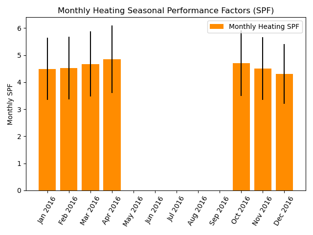

analysis package
================
The analysis packages provided provide some examples of the potential uses of oTherm GSHP data.  These are provided as is and have the following limitations:

- Each site has a single heat pump.  The analyses presented can, in the future, be extended to multiple pieces of equipment.   

Modules
-------

analysis.daily_summaries module
-------------------------------
.. automodule:: analysis.daily_summaries
   :members:
   :undoc-members:
   :show-inheritance:

analysis.load\_summary module
--------------------------------
.. automodule:: analysis.load_summary
   :members:
   :undoc-members:
   :show-inheritance:

analysis.ewt\_violins module
----------------------------
.. automodule:: analysis.ewt_violins
   :members:
   :undoc-members:
   :show-inheritance:

Example output:

.. image:: ./html/images/ewt_violin_plots.png
   :width: 400
   :alt: Example violin plots that show histograms of the entering water temperature under heating and cooling modes.

analysis.geoexchange\_proxies module
------------------------------------

analysis.hp\_mfr\_plots module
------------------------------

analysis.kwh\_per\_sf module
----------------------------
One particularly helpful analysis that can be accomplished with very simple monitoring equipment is the energy usage as a function of conditioned area and outdoor air temperature.   One application of this analysis offers an opportunity to compare the efficiency of different technologies, such as air-source and ground-source heat pumps over a wide range of outdoor weather conditions (e.g., Ueno and Loomis, 2015).

.. automodule:: analysis.kwh_per_sf
   :members:
   :undoc-members:
   :show-inheritance:

Example output:

.. image:: ./html/images/kwh_per_sf_v_oat.png
   :width: 400
   :alt: Example plot of time of energy use intensity as a function of outdoor air temperature

analysis.load\_factor module
----------------------------------
Because adoption of GSHP systems will often replace fossil-fuel fired systems and represent more energy intensive appliances in a home, electric utilities are also interested in the load factors for typical residential GSHP systems and the month-to-month variation in load factors over the course of a year.  For the purposes here, the load factor is defined as the ratio of the electricity consumed over a period of time, such as one month, to the consumption that would have occurred if the peak demand operated over the entire month.   The load factor ranges from 0 to 1, with higher values representing more uniform and predictable demand. 
  
.. math::
   Load Factor = \frac{kWh_{used \: in \: period}}{{kW_{peak} \cdot (hours \: in \: period)} }

.. automodule:: analysis.load_factor
   :members:
   :undoc-members:
   :show-inheritance:

analysis.spf\_with\_uncertainty module
--------------------------------------
The seasonal performance factor (SPF) is a metric used to evaluate the performance of installed heat pumps.  SPF values
are sometimes separated into monthly values or values binned on ranges of entering water temperatures.

In heating mode, the SPF is calculated similarly to the COP.  The difference is that COP values are determined under
laboratory conditions while the SPF values are calculated using real-world operational data.  Further, while COPs are
measured with laboratory-grade equipment, calculation of SPFs may use estimated or proxy values in lieu of measured values,
depending on the availability and quality of data.   The heating SPF is calculated as the ratio of the heating or
cooling provided and the electricity used to generate the heating or cooling:

.. math::
    SPF=\frac{\text{Heating or Cooling Provided [kWh]}}{\text{Electricity Used [kWh]}}

When calculating SPF values, it is important to note the boundaries of the analysis.  Spitler and Gehlin (2020) build
upon the SEPEMO boundaries defined by Nordman and others (2012) to delineate a set of nested boundaries the include
successively more components of the system.

Uncertainty Analysis
One of the primary challenges in analyzing SPF values and comparing them between systems or with laboratory-rate COP
values is the uncertainty associated with measurements used to calculate the SPF values.  All measurements have some
degree of associated uncertainty, but field measurements used to calculate SPF values generally are obtained with lower
quality sensors than those used the laboratory to calculate COP values.  As a result, they have a larger uncertainty due
to sensor bias.   Most studies that report measured performance (COP or SPF) do not quantify uncertainty (e.g.,
Puttagunta et al., 2010; Huelman et al., 2016) even though it can be significant.

Uncertainty due to sensor bias can be absolute or fractional. Absolute uncertainty has the same units as the value being
measured.  Fractional uncertainty is a fraction of the measured value. While the sensor bias for a given sensor will be
constant, the impact on the uncertainty of the calculated SPF depends on the measured value, which changes in time.  This
is of particular concern with the uncertainty of a measure of temperature difference.

Calculating the SPF of GSHP systems relies on quantifying the geoexchange (thermal energy exchanged with the subsurface)
and the electricity used by the GSHP system. Quantifying the geoexchange requires taking the product of density and
specific heat capacity of the heat transfer fluid, the mass flow rate of the heat transfer fluid, and the temperature
change of the heat transfer fluid across the heat pump. The uncertainties in the density and specific heat capacity
values are very small relative to the other uncertainties and are typically ignored (Spitler et al., in prep).  The
temperature change of the heat transfer fluid has a constant absolute uncertainty, meaning that the true temperature
change is within a fixed number of degrees from the measured value. Electricity usage measurements can have a fractional
or absolute uncertainty, depending on the measurement method.

Because the uncertainty of geoexchange and the electrical consumption of the GSHP system (EQ and Ew, respectively) can
change depending on the actual conditions, the uncertainty must be calculated separately for each timestep in the
period of interest. Following Taylor (1997), the fractional uncertainty for thermal energy exchanged with the subsurface
and the electrical consumption (eQ and eW, respectively) can then be calculated as:

.. math::
   e_{Q,n}= \frac{\sum_{i=1}^{n}E_{Q,n}}{\sum_{i=1}^{n}Q_i}

   e_{W,n}= \frac{\sum_{i=1}^{n}E_{W,n}}{\sum_{i=1}^{n}W_i}

Where Qi and Wi are the measured values of the geoexchange and electrical consumption, respectively.   The quantities
are summed over n time intervals, typically each 1-minute in duration.

The fractional uncertainty of the SPF value can then be obtained by adding the fractional uncertainties of the thermal
energy exchanged with the subsurface and the electrical consumption of the GSHP system in quadrature:

.. math::
   e_{SPF,n}=\ \sqrt(e_{Q,n}^2+e_{W,n}^2\ )

While this description of uncertainty analysis focuses on SPF calculations, as they involve multiple types of
measurements, uncertainty analysis should also be performed when calculating and reporting other key performance
indicators.

Example output:

.. automodule:: analysis.spf_with_uncertainty
   :members:
   :undoc-members:
   :show-inheritance:

analysis.time\_of\_day\_usage module
------------------------------------
There is a growing interest in quantifying hourly demand profiles for building heat and cooling to manage generation assets and explore models for demand-response programs (e.g., National Academies, 2021).   While heat pump usage patterns tend to vary with season – with winters having higher demand in morning and summer a higher demand in the afternoon – specific usage patterns depend on preferences of building occupants and individual usage patterns.  Quantifying patterns of usage across a large number of heat pumps in a given regions will help to inform utilities in forecasting weather-dependent generation patterns and identify opportunities for demand response measures. 

   
.. automodule:: analysis.time_of_day_usage
   :members:
   :undoc-members:
   :show-inheritance:

Example output:

.. image:: ./html/images/time_of_day_usage.png
   :width: 400
   :alt: Example plot of time of day usage for a site with the ground source heat pump

