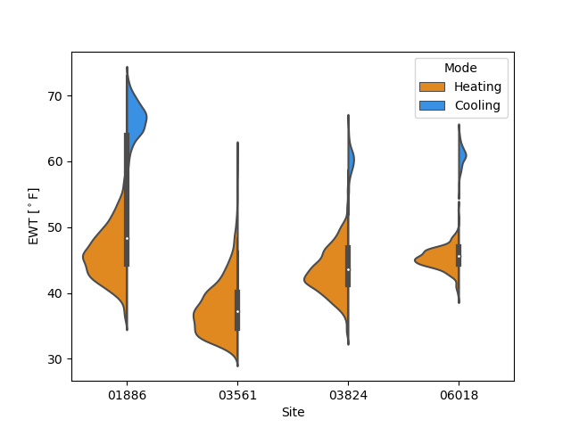
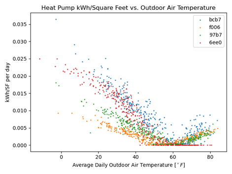

analysis package
================
The analysis packages provided provide some examples of the potential uses of oTherm GSHP data.  These are provided as is and have the following limitations:

- Each site has a single heat pump.  The analyses presented can, in the future, be extended to multiple pieces of equipment.   

Modules
-------

analysis.daily_summaries module
-------------------------------
.. automodule:: analysis.daily_summaries
   :members:
   :undoc-members:
   :show-inheritance:

analysis.load\_summary module
--------------------------------
.. automodule:: analysis.load_summary
   :members:
   :undoc-members:
   :show-inheritance:

analysis.ewt\_violins module
----------------------------
.. automodule:: analysis.ewt_violins
   :members:
   :undoc-members:
   :show-inheritance:

Example output:

analysis.geoexchange\_proxies module
------------------------------------

analysis.hp\_mfr\_plots module
------------------------------

analysis.kwh\_per\_sf module
----------------------------
One particularly helpful analysis that can be accomplished with very simple monitoring equipment is the energy usage as a function of conditioned area and outdoor air temperature.   One application of this analysis offers an opportunity to compare the efficiency of different technologies, such as air-source and ground-source heat pumps over a wide range of outdoor weather conditions (e.g., Ueno and Loomis, 2015).

.. automodule:: analysis.kwh_per_sf
   :members:
   :undoc-members:
   :show-inheritance:

Example output:

analysis.load\_factor module
----------------------------------
Because adoption of GSHP systems will often replace fossil-fuel fired systems and represent more energy intensive appliances in a home, electric utilities are also interested in the load factors for typical residential GSHP systems and the month-to-month variation in load factors over the course of a year.  For the purposes here, the load factor is defined as the ratio of the electricity consumed over a period of time, such as one month, to the consumption that would have occurred if the peak demand operated over the entire month.   The load factor ranges from 0 to 1, with higher values representing more uniform and predictable demand. 
  
.. math::
   Load Factor = \frac{kWh_{used \: in \: period}}{{kW_{peak} \cdot (hours \: in \: period)} }

analysis.spf\_with\_uncertainty module
--------------------------------------
Note:  add back in automodule when ready

.. automodule:: analysis.spf_with_uncertainty
   :members:
   :undoc-members:
   :show-inheritance:

analysis.time\_of\_day\_usage module
------------------------------------
There is a growing interest in quantifying hourly demand profiles for building heat and cooling to manage generation assets and explore models for demand-response programs (e.g., National Academies, 2021).   While heat pump usage patterns tend to vary with season – with winters having higher demand in morning and summer a higher demand in the afternoon – specific usage patterns depend on preferences of building occupants and individual usage patterns.  Quantifying patterns of usage across a large number of heat pumps in a given regions will help to inform utilities in forecasting weather-dependent generation patterns and identify opportunities for demand response measures. 

   
.. automodule:: analysis.time_of_day_usage
   :members:
   :undoc-members:
   :show-inheritance:

Example output:

.. image:: ./html/images/time_of_day_usage.png
   :width: 400
   :alt: Example plot of time of day usage for a site with the ground source heat pump

