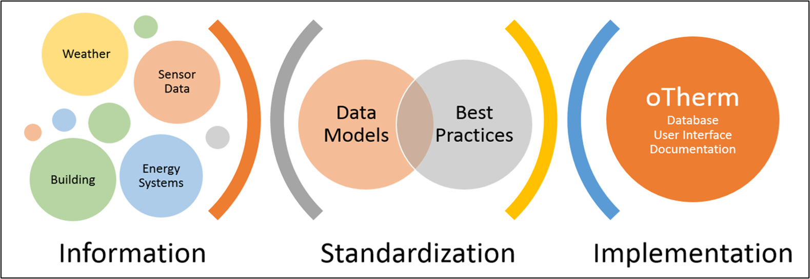

oTherm Project
==============

.. toctree::
   :maxdepth: 2
   :caption: Contents:
   
The *oTherm* project aims to standardize data collection methods for renewable thermal energy (RTE) systems, such as heat pumps
(air-source and ground-source), solar thermal, and biomass systems.  While the initial focus on the project has focused
on ground source heat pump systems, the framework is extensible to other types of RTE  systems.

Some of the challenges in the monitoring and verification (M&V) of RTE systems include:

- necessity for continuous data (approximately 1-minute resolution) of system energy flows, both thermal and electric power
- need to continously monitor the temperature of the renewable thermal source
- need to contextualize observations with respect to the equipment, the building envelope and outdoor weather conditions
- documentation of sensor accuracies for the quantification of uncertainty, which can be significant in RTE systems

These challenges often limit the number of facilities that can be included in an M&V program, most often ranging
from 3 - 24, and make it exceeding difficult to combine data from multiple studies.

The oTherm project establishes a standarized data framework and software necessary to efficiently collect and analyze
data within a given M&V program.  With the standardization of the data models, data from separate M&V program can
be easily included into cross-program analyses.

The initial work has been funded by the Renewable Thermal Alliance and the New York State Energy Research & Development
Authority.  Continued work has been supported by the US Department of Energy, Office of State Energy Programs.  The collaborative
research has been led by the University of New Hampshire in coordination with the Yale School for the Environment.